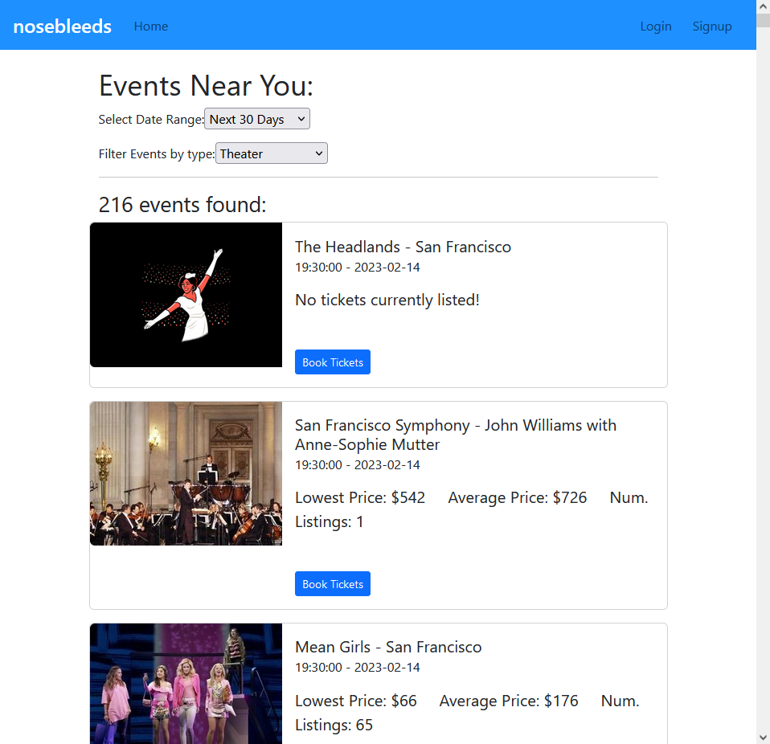

# Eventif

This app uses the [seakgeek API](https://platform.seatgeek.com/) and searches local event near you. 

Users are able to filter events based on predefined dates: 24 hours, 7 days, 30 days from the current time. They may also filter events based on type/genre.

This full stack application uses postgresQL and express for backend; react and redux for front end.

# 
<p align="center">
  
</p>

#
To run this project, clone this repo to your local machine and run:
```bash
npm run dev
```